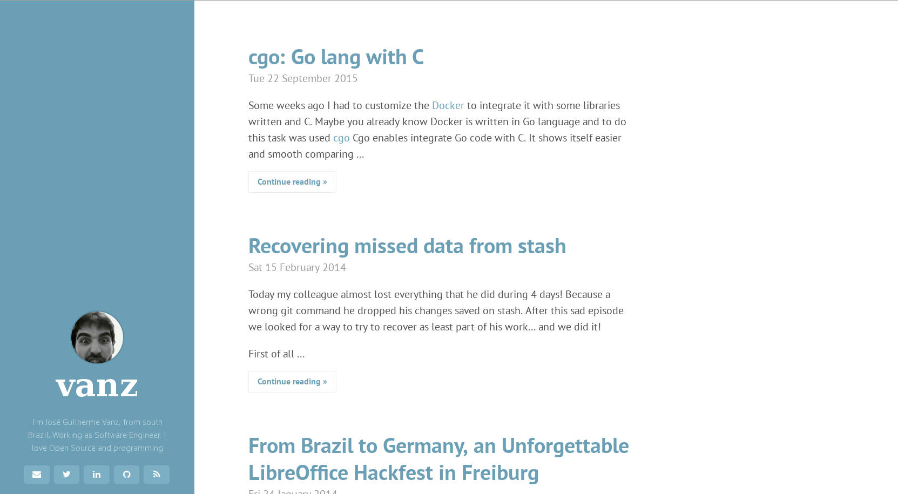

# pelican-hyde

The pelican-hyde is a [Pelican](https://github.com/getpelican) theme inspired on the beautiful [Hyde](http://hyde.getpoole.com/) Jekyll theme

You can see a live demo [here](http://jvanz.github.io/)

Pull requests are welcome

## Settings

List of Pelican's settings that are supported by this theme. Refer to the
[Pelican's documentation](https://docs.getpelican.com/en/stable/settings.html)
for more details.

- `FEED_*` and `*_FEED_*`
- `DEFAULT_PAGINATION`
- `DISPLAY_PAGES_ON_MENU`
- `DISQUS_SITENAME`
- `GOOGLE_ANALYTICS`
- `GA_COOKIE_DOMAIN`
- `SITESUBTITLE`
- `MENUITEMS`
- `SOCIAL`

Additional settings:

- `BIO` - short biography to display in the sidebar, eg. `Hello world`
- `PROFILE_IMAGE` - image to display in the sidebar, eg. `avatar.png`
- `FOOTER_TEXT` - footer to display in the sidebar, eg. `(C) 2020 Foo Bar`
- `COLOR_THEME` - base colors for the theme, choose from `08` to `0f`,
  refer to <https://github.com/poole/hyde> for details.
- `FONT_AWESOME_CSS` - URL to get Font Awesome as CSS
- `FONT_AWESOME_JS` - URL to get Font Awesome as Javascript
- `FONT_ACADEMICONS` - set to `True` to fetch the [Academicons font](https://jpswalsh.github.io/academicons/)

By default, the theme uses **Fork Awesome**, which is fetched from
`cdn.jsdelivr.net`. Fork Awesome is a drop-in replacement for Font Awesome v4,
but is not compatible with Font Awesome v5 and later, so if you want to use
Font Awesome v5+, setting `FONT_AWESOME_CSS` is not enough, you will also need
to modify the templates.

## Authors

- Original theme by [Mark Otto](https://github.com/mdo): <https://github.com/poole/hyde>
- Ported to Pelican by [José Guilherme Vanz](https://github.com/jvanz)

## License

Released under the [MIT license](LICENSE)
